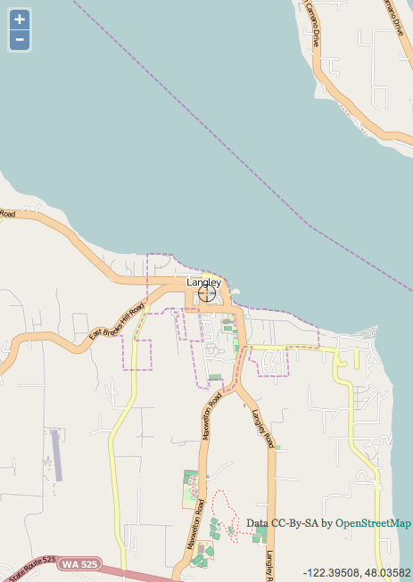
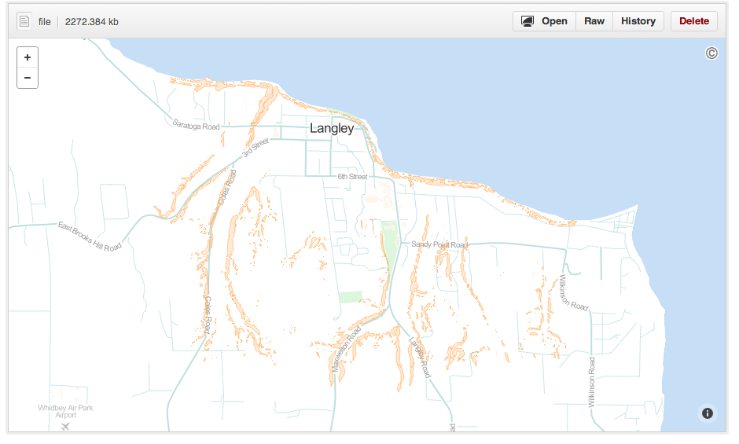
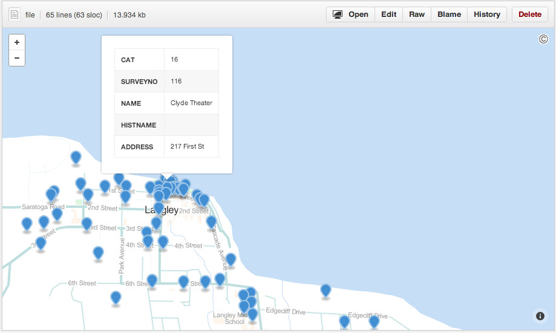
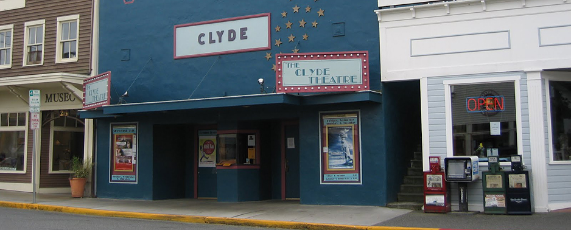
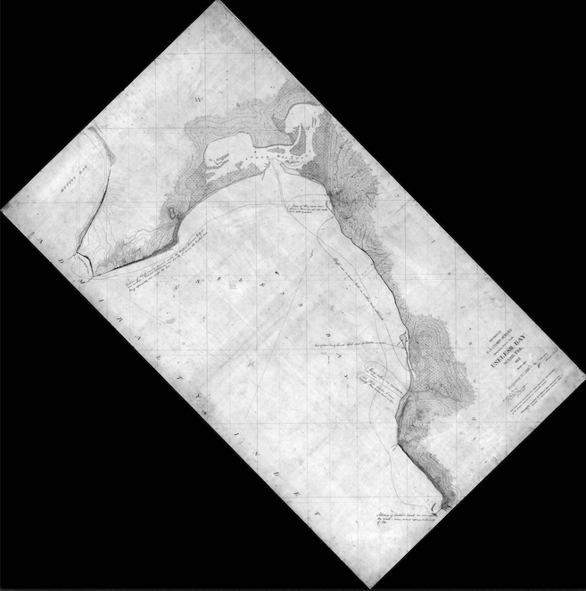

<!------------------------------------------------------------>
<!-- Topic: xxx -->

<h1>Langley WA</h1>
 

<!------------------------------------------------------------>
--SLIDE--
<!-- Topic: yyy -->

<h1>What we are doing...</h1>

--SUBSLIDE--

<h2>Integrating programming and GIS skills for  "Civic Hacking"</h2>

--SLIDE--
<h1> Tools/Tech<h2>

--SUBSLIDE--

<h2>GRASS/qgis   ogr/gdal   shell scripting   GeoJSON   git/github/github pages  Markdown   Revealz
--SLIDE--

<h1>Process<h1>

--SUBSLIDE--
<h2> <h2>
<h2> Extract GRASS Data using Qgis

--SUBSLIDE--
<h2>Reproject<h2>

--SUBSLIDE--

<h2>GeoJSON and GitHub</h2>

--SUBSLIDE--
<H2> Available Data<h2>  
<H3> Wetlands   City Limits   Parcels   Forests   Roads <h3>

<!------------------------------------------------------------>
--SLIDE--
<!-- Topic: zzz -->

<h1>Why...</h1>

--SUBSLIDE--

<h2>Participation     Collabortion     Problem Solving</h2>

--SLIDE--
<h1>What is next...<h2>
--SUBSLIDE--
<h2> Web App<h2>

--SUBSLIDE--
<h2> Historic Inventory<h2>

--SUBSLIDE--

--SUBSLIDE--
<h2> ogr and T sheets<h2>

